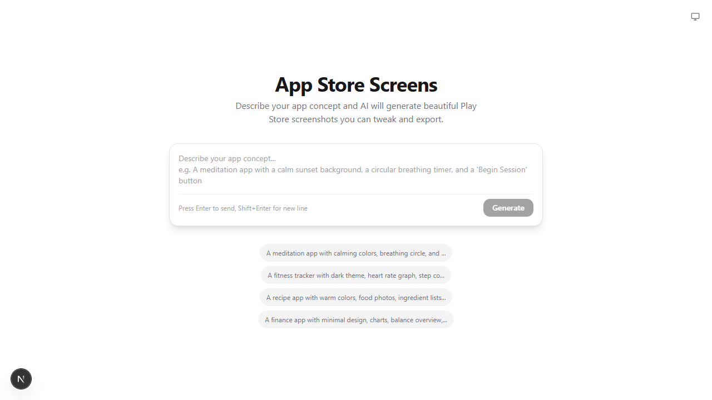
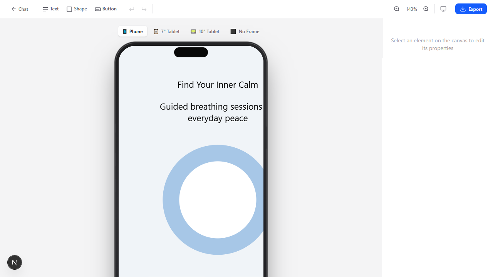

# App Store Screens — AI-Powered Play Store Asset Generator

Describe your app concept and AI will generate beautiful, high-fidelity Play Store screenshots you can tweak on an interactive canvas and export at exact Play Store dimensions.

## Screenshots

### Chat Composer — Describe Your App



### Canvas Editor — Tweak & Polish



## Features

- **AI Layout Generation** — Type your app idea and GPT-4o / Gemini generates a complete mobile screen layout
- **Interactive Canvas Editor** — Drag, resize, and rotate elements with visual handles
- **Device Frames** — Realistic phone, 7" tablet, and 10" tablet bezels with Dynamic Island
- **Property Panel** — Edit text, colors, fonts, borders, opacity, rotation, and z-index
- **Alignment Tools** — Align left/center/right/top/middle/bottom, distribute horizontally/vertically
- **Layer Ordering** — Bring to front / send to back
- **Keyboard Shortcuts** — Arrow nudge (1px, Shift+10px), Delete, Ctrl+Z undo/redo
- **Export** — Download individual Play Store assets or a complete ZIP bundle:
  - Feature Graphic: 1024 × 500
  - Phone Screenshot: 1080 × 1920
  - 7" Tablet: 1280 × 800
  - 10" Tablet: 2560 × 1800

## Tech Stack

| Layer | Choice |
|-------|--------|
| Framework | Next.js 16 (App Router) |
| Styling | Tailwind CSS v4 |
| AI | Vercel AI SDK (OpenAI GPT-4o / Google Gemini) |
| State | Zustand |
| Export | `dom-to-image-more` + HTML5 Canvas high-DPI pipeline |
| Bundling | Turbopack |

## Getting Started

1. Install dependencies:
   ```bash
   npm install
   ```

2. Set up environment variables in `.env.local`:
   ```env
   # Choose provider: google or openai
   AI_PROVIDER=openai

   # OpenAI (recommended for best design quality)
   OPENAI_API_KEY=sk-your-key-here
   OPENAI_MODEL=gpt-4o

   # Or Google Gemini
   GOOGLE_GENERATIVE_AI_API_KEY=your-key-here
   GOOGLE_MODEL=gemini-2.0-flash-001
   ```

3. Run the dev server:
   ```bash
   npm run dev
   ```

4. Open [http://localhost:3000](http://localhost:3000)

## Project Structure

```
app/
├── page.tsx              # Main app shell (chat ↔ canvas)
├── layout.tsx            # Root layout (dark mode, system fonts)
├── globals.css           # Tailwind v4 theme
├── api/
│   ├── generate/         # POST /api/generate — AI layout generation
│   ├── refine/           # POST /api/refine — layout refinement
│   └── export/           # POST /api/export — server-side export
components/
├── chat/
│   ├── ChatView.tsx      # Chat landing + generation flow
│   ├── ChatComposer.tsx  # Prompt input
│   └── ChatPanel.tsx     # Message history
├── canvas/
│   ├── Canvas.tsx        # Interactive canvas (drag, resize, rotate)
│   ├── CanvasView.tsx    # Canvas + toolbar + property panel layout
│   ├── DeviceFrame.tsx   # Realistic phone/tablet bezels
│   ├── DeviceSelector.tsx
│   ├── PropertyPanel.tsx # Element property editor
│   └── Toolbar.tsx       # Add elements, undo/redo, align, export
├── export/
│   └── ExportPanel.tsx   # Play Store size presets + ZIP export
├── layout/
│   └── ScreenRenderer.tsx # JSON layout → visual DOM
└── ThemeToggle.tsx
lib/
├── ai/
│   ├── generate.ts       # System prompt + AI generation
│   ├── provider.ts       # OpenAI / Google model switcher
│   └── schema.ts         # Zod schema for structured output
├── store/
│   └── useAppStore.ts    # Zustand store (layout, history, selection)
├── layout/
│   ├── export.ts         # High-DPI canvas export pipeline
│   └── types.ts
└── playstore/
    └── sizes.ts          # Play Store dimension presets
```

## License

MIT
